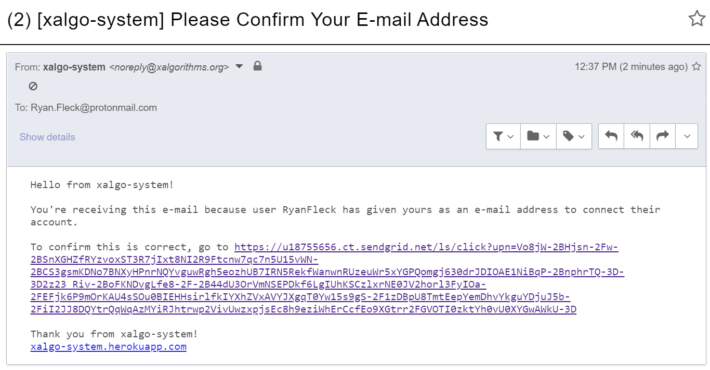

# Xalgorithms RM/RT System Prototype No. 4

This React/Django system is the fourth prototype in the series of visual rule editors, and the most complete.
It contains the the code to deploy a frontend and backed from the same
Heroku container for easy sharing, discussion, and iteration.

## Development

Install _Docker Desktop_ on Windows 10/OSX, or docker and docker-compose on GNU/Linux, then run the following
to build and run the system, including all required services, locally:

```sh
docker-compose -f development.yml up
```

Use pre-commit to keep code quality up: `pre-commit install`


## Usage

Casual users can simply browse to <https://xalgo-system.herokuapp.com/>, create and verify an account, then begin testing.

The account verification email may arrive in your junk mail:




## Resources

1. A previous deployment experiment: <https://github.com/RyanFleck/Django-React-Heroku-Test>
1. JWT Tutorial: <https://hackernoon.com/110percent-complete-jwt-authentication-with-django-and-react-2020-iejq34ta>
